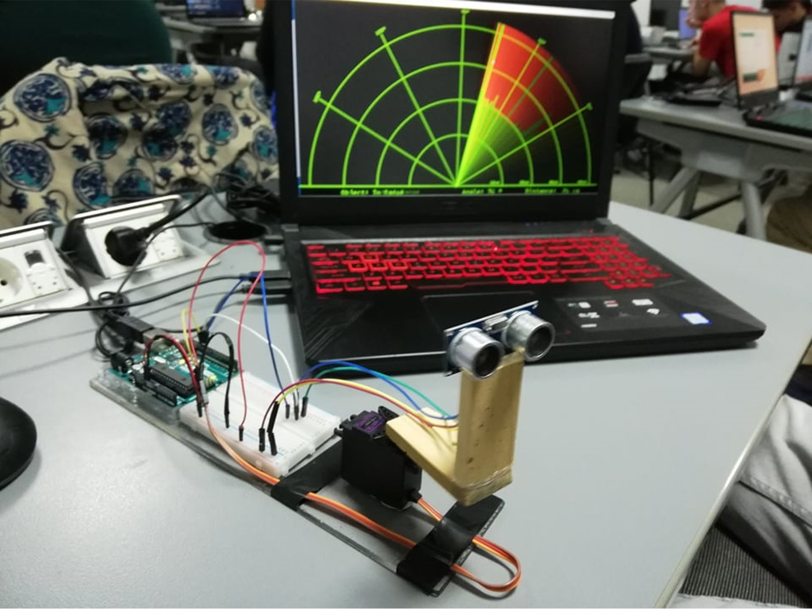

# Arduino-Radar
Arduino based Radar written in C++ with Processing being done in Java, leveraging real-time data using an HC-SR04 ultrasonic sensor.

This project was made for the completion of my Embedded Systems course at university.

Tools used:

[1. Arduino IDE](https://www.arduino.cc/en/software)

[2. Processing IDE](https://processing.org/download/)

[3. Fritzing](https://fritzing.org/)

  

